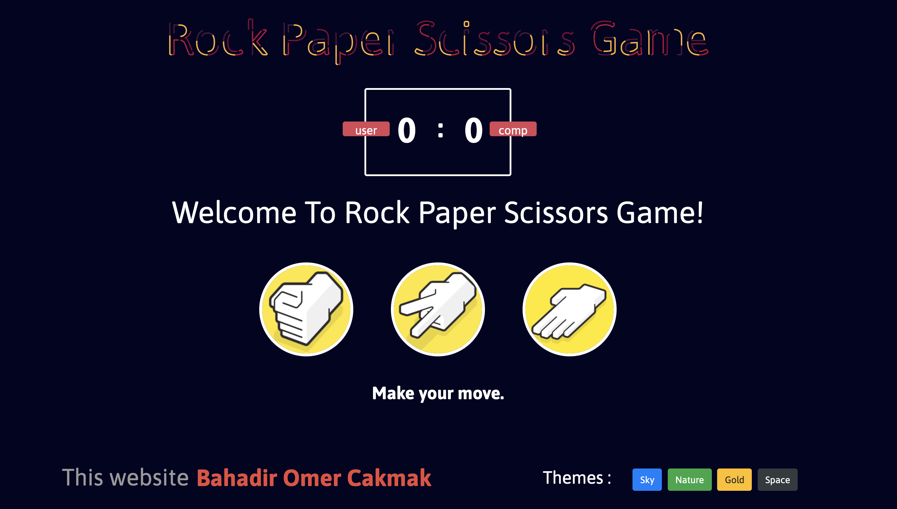

# Rock Paper Scissors Game

&nbsp; &nbsp;&nbsp; &nbsp; Rock paper scissors is a hand game usually played between two people, in which each player simultaneously forms one of three shapes with an outstretched hand. These shapes are "rock", "paper", and "scissors".
 
&nbsp; &nbsp;&nbsp; &nbsp; A simultaneous, zero-sum game, it has only two possible outcomes: a draw, or a win for one player and a loss for the other. A player who decides to play rock will beat another player who has chosen scissors ("rock crushes scissors" or sometimes "blunts scissors"), but will lose to one who has played paper ("paper covers rock"); a play of paper will lose to a play of scissors ("scissors cuts paper"). If both players choose the same shape, the game is tied and is usually immediately replayed to break the tie.
 
&nbsp; &nbsp;&nbsp; &nbsp; I integrated the real-life game to play on the computer. However, you play against the computer in the game. Have fun!
 

deneme

